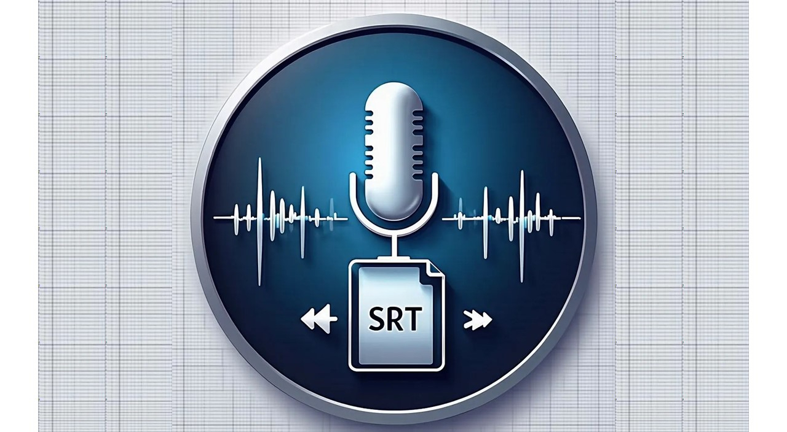

# VoiceToSRT - 视频字幕生成工具

<div align="center">
     
</div>

[](https://github.com/CARLPC/voicetosrt)

## 项目简介

VoiceToSRT 是一个本地或网络视频字幕、人声、伴奏生成助手。它能够：

- 📥 支持从 URL 下载视频或上传本地视频
- 🎵 使用先进的 vocal removal 技术分离人声和伴奏
- 🎤 提取纯净的人声进行语音识别
- 📝 生成标准 SRT 格式字幕文件

**在线demo**: [Demos](https://modelscope.cn/studios/lpcarl/VoiceToSRT/)

## 技术架构

### 核心功能模块

| 模块 | 描述 |
|------|------|
| `app.py` | 主应用程序，处理视频上传、音频识别、SRT生成 |
| `vr.py` | 人声分离模块，包含 AudioPre 和 AudioPreDeEcho 类 |
| `lib/lib_v5/` | 音频处理神经网络模型和工具 |

### 依赖技术

- **语音识别**: OpenAI Whisper
- **人声分离**: VR (Vocal Remover) 深度学习模型
- **音频处理**: FFmpeg + PyTorch
- **GPU 加速**: 支持 CUDA (NVIDIA) 和 Intel XPU

## 安装说明

### 环境要求

- Python 3.8+
- FFmpeg
- Anaconda (推荐)
- NVIDIA CUDA 或 Intel GPU (可选)

### 快速安装

#### CUDA 机器 (NVIDIA GPU)

```bash
# 克隆源码
git clone git@github.com:CARLPC/voicetosrt.git

# 安装 Anaconda
winget install Anaconda.Anaconda3 --accept-package-agreements

# 安装 FFmpeg
winget install Gyan.FFmpeg --accept-package-agreements

# 运行程序
./run_cuda.cmd
```

#### Intel GPU 机器

```bash
# 克隆源码
git clone git@github.com:CARLPC/voicetosrt.git

# 安装 Anaconda
winget install Anaconda.Anaconda3 --accept-package-agreements

# 安装 FFmpeg
winget install Gyan.FFmpeg --accept-package-agreements

# 运行程序
./run_xpu.cmd
```

## 模型下载

首次运行程序后会自动下载 Whisper 模型，也支持手动下载：

```bash
# 可用模型列表
"tiny.en": "https://openaipublic.azureedge.net/main/whisper/models/d3dd57d32accea0b295c96e26691aa14d8822fac7d9d27d5dc00b4ca2826dd03/tiny.en.pt",
"tiny": "https://openaipublic.azureedge.net/main/whisper/models/65147644a518d12f04e32d6f3b26facc3f8dd46e5390956a9424a650c0ce22b9/tiny.pt",
"base.en": "https://openaipublic.azureedge.net/main/whisper/models/25a8566e1d0c1e2231d1c762132cd20e0f96a85d16145c3a00adf5d1ac670ead/base.en.pt",
"base": "https://openaipublic.azureedge.net/main/whisper/models/ed3a0b6b1c0edf879ad9b11b1af5a0e6ab5db9205f891f668f8b0e6c6326e34e/base.pt",
"small.en": "https://openaipublic.azureedge.net/main/whisper/models/f953ad0fd29cacd07d5a9eda5624af0f6bcf2258be67c92b79389873d91e0872/small.en.pt",
"small": "https://openaipublic.azureedge.net/main/whisper/models/9ecf779972d90ba49c06d968637d720dd632c55bbf19d441fb42bf17a411e794/small.pt",
"medium.en": "https://openaipublic.azureedge.net/main/whisper/models/d7440d1dc186f76616474e0ff0b3b6b879abc9d1a4926b7adfa41db2d497ab4f/medium.en.pt",
"medium": "https://openaipublic.azureedge.net/main/whisper/models/345ae4da62f9b3d59415adc60127b97c714f32e89e936602e85993674d08dcb1/medium.pt",
"large-v1": "https://openaipublic.azureedge.net/main/whisper/models/e4b87e7e0bf463eb8e6956e646f1e277e901512310def2c24bf0e11bd3c28e9a/large-v1.pt",
"large-v2": "https://openaipublic.azureedge.net/main/whisper/models/81f7c96c852ee8fc832187b0132e569d6c3065a3252ed18e56effd0b6a73e524/large-v2.pt",
"large-v3": "https://openaipublic.azureedge.net/main/whisper/models/e5b1a55b89c1367dacf97e3e19bfd829a01529dbfdeefa8caeb59b3f1b81dadb/large-v3.pt",
"large": "https://openaipublic.azureedge.net/main/whisper/models/e5b1a55b89c1367dacf97e3e19bfd829a01529dbfdeefa8caeb59b3f1b81dadb/large-v3.pt",
```

**推荐**: 对于中文语音识别，建议使用 `large-v3` 模型以获得最佳效果。

## 使用方法

1. 运行 `run_cuda.cmd` (NVIDIA GPU) 或 `run_xpu.cmd` (Intel GPU)
2. 通过界面上传本地视频或输入视频 URL
3. 程序自动完成：
   - 提取音频
   - 分离人声和伴奏
   - 语音识别
   - 生成 SRT 字幕

## 项目结构

```
voicetosrt/
├── app.py                 # 主程序入口
├── vr.py                  # 人声分离模块
├── lib/
│   ├── lib_v5/            # 神经网络模型
│   │   ├── dataset.py     # 数据集处理
│   │   ├── layers.py      # 网络层定义
│   │   ├── nets.py        # 网络架构
│   │   ├── spec_utils.py  # 频谱处理工具
│   │   └── modelparams/   # 模型参数配置
│   ├── utils.py           # 工具函数
│   └── name_params.json   # 模型名称映射
├── example/               # 示例文件
├── run_cuda.cmd           # CUDA 启动脚本
└── run_xpu.cmd            # Intel XPU 启动脚本
```
## 赞赏码
<div align="center">
     
</div>

## 星标历史

[](https://www.star-history.com/?repos=CARLPC%2Fvoicetosrt&type=date&legend=top-left)

## 许可证

本项目仅供学习交流使用，请遵守相关法律法规。


